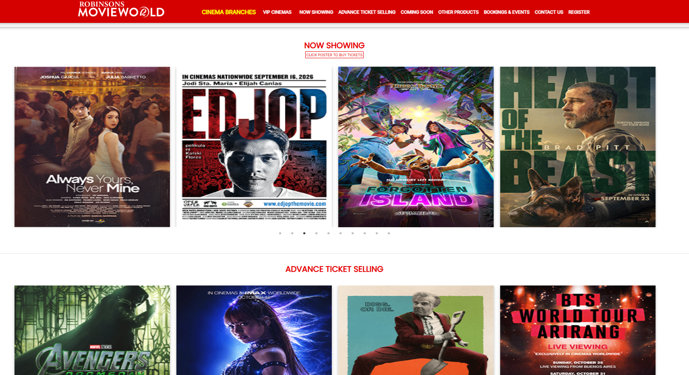

# Software in the Wild: Improving the Diyandi Experience Through Software

> **Name:** Luke Ryan C. Ruaya  
> **Section:** CS3A  
> **Date submitted:** 2026-09-30

---

## 1. User group

**Who are you designing for?**  
Local residents, students, and festival attendees visiting the Mugna carnival rides during the Diyandi Festival sa Iligan.

**Why might this group need support during Diyandi?**  
During the festival, carnival places experience overcrowding during late afternoons or evenings. Attendees often spend a portion of their time waiting in slow, congested lines just to buy ride tickets which leads to frustration before they can even enjoy the ride itself.

---

## 2. Situation or need

**What is this group trying to do during Diyandi?**  
Festival goers are trying to buy ride tickets for specific Mugna attractions such as Ferris Wheel, Topspin, Viking, etc. quickly so they can maximize their time spent during the festival.

---

## 3. Problem or inconvenience

**What may make this task difficult, confusing, unsafe, slow, or inconvenient?**  
Physical ticket booths at Mugna create bottlenecks. Visitors must line up twice, first at the ticketing booth to buy the ride tickets with cash, and again at the entrance of each individual ride.

---

## 4. Proposed digital solution

**What digital tool would you propose?**  
A responsive web application for Mugna ride ticketing, inspired by Robinsons Movieworld's online ticketing website. The platform allows uesrs to view available rides and their operating schedules, buy tickets in advanced and receive a scannable QR code on their mobile screens.

**How would it help the intended users?**  
It removes ticket purchasing from the physical carnival grounds. Attendees can directly proceed to the ride queue after just scanning their QR code received from the web app, bypassing the ticket booth and cutting their total time spent waiting.

---

## 5. Things users can do

Describe **two specific actions** that users could perform using your proposed system.

1. Users can select a ride from the web app, choose the number of tickets, and complete payment via e-wallet (GCash, PayMaya, debit, credit, etc.)
2. Users can view their purchased ticket in their mobile browser and show the generated QR code to the ride operator for quick and contactless validation

---

## 6. Important qualities

Identify **two qualities** that would make your proposed system useful. You may consider whether it should be easy to use, fast, reliable, safe, private, accessible, multilingual, low-data, clear, or available during high demand.

### Quality 1: High Performance

**Why does this matter to users?**  
Mugna receives massive traffic during peak hours (festival evening or weekends). If the website is slow, users could potentially experience double charges (e.g. the system not being able to record that the ticket has been bought, which might prompt the user back to the checkout again) or unable to receive their QR codes.

### Quality 2: Low-Data Usage

**Why does this matter to users?**  
Carnival attendees primarily access the website using mobile data amid dense crowd where cellular bandwidth may be throttled. The website or platform must be lightweight and quick to load so users can access their QR codes even under weak connectivity.

---

## 7. How to tell whether the solution helped

How could you determine whether your proposed solution actually helped users?

Provide surveys asking users to rate the ease of purchasing and whether buying tickets digitally reduced their stress of buying it physically; Track the proportion of total carnival rides validated via QR codes compared to physical tickets; Measure the average time it takes to buy a ticket online versus buying one at the booth.

---

## 8. Screenshot or reference

You may include **one screenshot** or reference image only if it does not contain personal, confidential, or sensitive information.

> Do not include passwords, private messages, account numbers, grades, addresses, personal information, or other confidential content.

**External sources used, if any:**  
[https://robinsonsmovieworld.com](https://robinsonsmovieworld.com/)

---

## AI use declaration

Select **one** option below and complete the applicable details.

- [x] **No AI tools used.** I did not use any generative AI tool in preparing this submission.

- [ ] **AI tools used.** I used the following AI tool(s): [Write tool name(s), e.g., ChatGPT, Gemini, Copilot].

  **Purpose of use:**  
  [Describe specifically how you used the tool. Examples: brainstorming possible user groups; clarifying an idea; checking grammar; generating possible questions to consider.]

  **How I reviewed the output:**  
  [Explain how you checked, revised, verified, or adapted the AI-generated output.]

  **Prompt(s) or summary of interaction:**  
  [Paste the main prompt(s) used, provide a link to the shared conversation if available, or summarize the interaction clearly enough for the instructor to understand the assistance received.]

> I understand that I remain responsible for the accuracy, originality, and quality of this submission. I confirm that I reviewed and revised any AI-generated content and can explain all ideas submitted under my name.

---

## Student declaration

I confirm that this work is based primarily on my own observation, experience, and reasoning. Any external sources or tools used have been acknowledged above.

**Name:** Luke Ryan C. Ruaya
